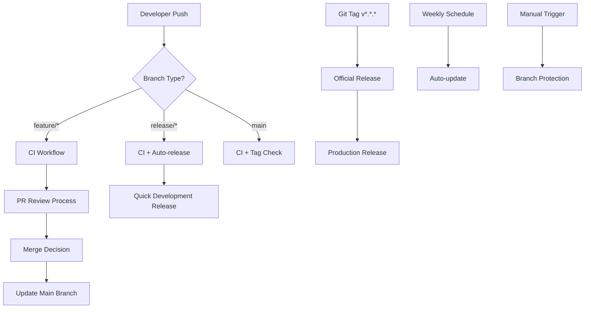

# 🔄 GitHub Actions Workflows

This directory contains all GitHub Actions workflows for the `gh_classroom_tools` repository. Each workflow serves a specific purpose in our CI/CD pipeline and repository management.

## � Complete Workflow Suite

| Workflow | Trigger | Purpose | Status |
|----------|---------|-----## 🔧 Configuration & Setup

### PyPI Publishing (OIDC) - **NEW**
**No secrets required!** Our publish workflow now uses OpenID Connect for secure PyPI publishing:

- **🔒 Trusted Publishing**: GitHub OIDC directly authenticates with PyPI
- **🛡️ Zero Token Management**: No need to store or rotate API tokens
- **✅ Enhanced Security**: Eliminates secret exposure risks
- **⚡ Better Performance**: Direct authentication without token lookups

**Setup Required**: Configure trusted publishing on [PyPI project settings](https://pypi.org/manage/project/classroom-pilot/settings/publishing/).

### Required Secrets
| Secret | Purpose | Required For | Status |
|--------|---------|--------------|--------|
| `GITHUB_TOKEN` | GitHub API access (auto-provided) | All workflows | ✅ Auto |
| `GH_PAT` | Enhanced permissions for protection | Branch protection | ✅ Required |
| ~~`PYPI_API_TOKEN`~~ | ~~PyPI publishing~~ | ~~Publish workflow~~ | 🔒 **Replaced by OIDC** |

### Modern Infrastructure Updates
- **🚀 Python Actions v5**: Updated setup-python for faster dependency installation
- **📦 Optimized Caching**: Aligned Poetry virtualenv strategy with cache paths
- **🔄 Smart Retries**: Exponential backoff for all network operations
- **🧹 Cache Cleanup**: Removed unused lint cache directories for efficiency

### Required Permissions
Enhanced permission model with OIDC integration:
- `contents: write` - Create releases and update files
- `pull-requests: write` - Create and update PRs  
- `id-token: write` - **NEW**: OIDC token generation for PyPI publishing
- `attestations: write` - **NEW**: Build attestation generation
- `actions: read` - Workflow context access|
| [🤖 auto-release.yml](#-automated-release) | Push to `main` | Quick automated releases from feature branches | ✅ Active |
| [🚀 release.yml](#-official-release) | Git tags (`v*.*.*`) | Official production releases with full validation | ✅ Active |
| [🔍 branch-name-check.yml](#-branch-name-check) | PR creation/updates | Enforce branch naming conventions | ✅ Active |
| [🛡️ branch-protection.yml](#️-branch-protection) | Manual dispatch | Apply protection rules to main branch | ✅ Active |
| [🧪 ci.yml](#-continuous-integration) | PR/Push events | Continuous integration testing | ✅ Active |
| [🔄 auto-update.yml](#-automated-updates) | Weekly schedule | Automated dependency updates | ✅ Active |

## 🚀 Recent Optimizations & Improvements

**Latest Updates (September 2025)**: Our workflows have been significantly enhanced with modern best practices:

- **🛠️ Workflow Utilities**: New centralized logging and retry mechanisms via `workflow_utils.sh`
- **🔒 OIDC Publishing**: Migrated to trusted PyPI publishing eliminating API token dependencies
- **⚡ Performance**: Optimized caching strategies and updated to Python setup v5
- **🛡️ Error Handling**: Standardized retry logic and comprehensive error reporting
- **📦 Build Quality**: Enhanced build verification and content validation
- **🔧 Infrastructure**: Improved cache efficiency and removed unused paths

These improvements provide more reliable, secure, and maintainable automation across all workflows.

---

## 🤖 Automated Release

**File**: [`workflows/auto-release.yml`](./workflows/auto-release.yml)

### Purpose
Automatically creates releases when feature branches are merged to the main branch. Designed for quick development iterations and continuous deployment.

### Triggers
- Push to `main` branch (only when merged from `release/*` or `hotfix/*` branches)

### Features
- ✅ Automatic version detection from branch names
- ✅ PR-based changelog generation
- ✅ GitHub release creation
- ✅ Fast deployment for development cycles

### Usage Example
```bash
# Create a release branch
git checkout -b release/1.2.3

# Make your changes and commit
git add .
git commit -m "feat: add new feature"

# Push and create PR
git push origin release/1.2.3
# Create PR to main branch

# Once merged → auto-release.yml triggers automatically
```

### Expected Branch Format
- `release/X.Y.Z` (e.g., `release/1.2.3`)
- `hotfix/X.Y.Z` (e.g., `hotfix/1.2.1`)

---

## 🚀 Official Release

**File**: [`workflows/publish.yml`](./workflows/publish.yml)

### Purpose
Creates comprehensive, production-ready releases with full validation, testing, and security scanning. Used for major releases and production deployments.

### Triggers
- Git tags matching pattern `v*.*.*` (e.g., `v1.2.3`, `v2.0.0-beta.1`)
- Manual workflow dispatch

### Recent Security & Performance Improvements (September 2025)
- **🔒 OIDC Publishing**: Migrated to trusted PyPI publishing (no API tokens required)
- **🚀 Python v5**: Updated setup-python action for faster performance
- **📦 Build Quality**: Enhanced build content verification and validation
- **🔄 Smart Retries**: Standardized retry logic for PyPI verification
- **📝 Centralized Logging**: Integrated workflow_utils.sh for consistent messaging

### Features
- ✅ Comprehensive validation and testing across Python 3.10, 3.11, 3.12
- ✅ **OIDC-based PyPI publishing** (secure, no token management)
- ✅ **Enhanced build verification** with content validation
- ✅ Poetry-based dependency management with optimized caching
- ✅ Detailed release notes generation
- ✅ Pre-release support (alpha, beta, RC)
- ✅ **Smart retry mechanisms** for network operations
- ✅ GitHub release creation with artifacts

### Supported Version Formats
- **Stable**: `v1.2.3`
- **Alpha**: `v1.2.3-alpha.1`
- **Beta**: `v1.2.3-beta.1`
- **Release Candidate**: `v1.2.3-rc.1`

### Usage Example
```bash
# For stable releases
git tag v1.2.3
git push origin v1.2.3

# For pre-releases
git tag v1.3.0-beta.1
git push origin v1.3.0-beta.1

# For release candidates
git tag v2.0.0-rc.1
git push origin v2.0.0-rc.1
```

---

## 🔍 Branch Name Check

**File**: [`workflows/branch-name-check.yml`](./workflows/branch-name-check.yml)

### Purpose
Enforces branch naming conventions to maintain consistency and enable automation.

### Triggers
- Pull Request events (opened, edited, synchronize, reopened) targeting `main` or `develop`

### Allowed Branch Patterns
- `feature/*` - New features
- `bugfix/*` - Bug fixes
- `hotfix/*` - Critical fixes
- `release/*` - Release preparation
- `docs/*` - Documentation updates
- `chore/*` - Maintenance tasks

### Examples
✅ **Valid branch names:**
- `feature/add-user-authentication`
- `bugfix/fix-login-issue`
- `hotfix/1.2.1`
- `release/2.0.0`
- `docs/update-readme`
- `chore/update-dependencies`

❌ **Invalid branch names:**
- `my-feature` (missing prefix)
- `FEATURE/add-login` (wrong case)
- `fix_bug` (wrong separator)

---

## �️ Branch Protection

**File**: [`workflows/branch-protection.yml`](./workflows/branch-protection.yml)

### Purpose
Automatically applies protection rules to the main branch to ensure code quality and security.

### Triggers
- Manual dispatch (`workflow_dispatch`)

### Protection Rules Applied
- ✅ Require pull request reviews
- ✅ Require status checks to pass
- ✅ Require branches to be up to date
- ✅ Require conversation resolution
- ✅ Restrict pushes to main branch

### Usage
1. Go to **Actions** tab in GitHub
2. Select **Branch Protection** workflow
3. Click **Run workflow**
4. Protection rules will be applied to `main` branch

---

## 🧪 Continuous Integration

**File**: [`workflows/ci.yml`](./workflows/ci.yml)

### Purpose
Runs comprehensive tests and quality checks on all code changes to ensure stability and quality.

### Triggers
- Pull Request events (opened, synchronize, reopened)
- Push to main branch

### Recent Improvements (September 2025)
- **🚀 Python Setup v5**: Updated to latest setup-python action for better performance
- **📦 Optimized Caching**: Removed unused lint cache paths, improved cache hit rates
- **🔄 Retry Logic**: Standardized retry_with_backoff across all operations
- **🛡️ Test Quality**: Fixed help command tests that were masking failures
- **📝 Enhanced Logging**: Integrated workflow_utils.sh for consistent messaging

### Test Matrix
- **Operating Systems**: Ubuntu, macOS, Windows
- **Shells**: bash, zsh, dash (where applicable)

### Quality Checks
- ✅ Syntax validation
- ✅ ShellCheck static analysis (with optimized caching)
- ✅ Script execution tests (with proper failure detection)
- ✅ Configuration validation
- ✅ Cross-platform compatibility
- ✅ Help command validation (no longer masks failures)

---

## 🔄 Automated Updates

**File**: [`workflows/auto-update.yml`](./workflows/auto-update.yml)

### Purpose
Automatically updates dependencies and creates pull requests for review.

### Triggers
- Weekly schedule (Sundays at 2 AM UTC)
- Manual dispatch (`workflow_dispatch`)

### Updates Managed
- ✅ GitHub Actions versions
- ✅ Shell dependencies
- ✅ Configuration updates
- ✅ Security patches
- ✅ Repository health checks

---

## 🚀 Comprehensive Usage Guide

### For Developers

#### 1. **Feature Development**
```bash
# Create feature branch (follows naming conventions)
git checkout -b feature/my-new-feature

# Develop and test locally
# Push and create PR → CI runs automatically
git push origin feature/my-new-feature
```

#### 2. **Quick Development Releases**
```bash
# Create release branch for automatic deployment
git checkout -b release/1.2.3

# Finalize release changes
git push origin release/1.2.3
# Create PR to main → Auto-release triggers after merge
```

#### 3. **Production Releases (Official)**
```bash
# Create and push semantic version tag
git tag v1.2.3
git push origin v1.2.3
# → Full validation and production release process
```

### For Repository Maintainers

#### **Setup Branch Protection**
1. Go to **Actions** tab in GitHub
2. Select **Branch Protection** workflow
3. Click **Run workflow**
4. Protection rules applied to `main` branch

#### **Monitor & Maintain**
- Check **Actions** tab for workflow status
- Review failed workflows and address issues
- Monitor automated updates and approve PRs
- Ensure all required secrets are configured

---

## �️ Workflow Infrastructure

### Workflow Utilities (`workflow_utils.sh`)

Our workflows now use centralized utilities for consistent logging and error handling:

**File**: [`.github/scripts/workflow_utils.sh`](.github/scripts/workflow_utils.sh)

#### Logging Functions
```bash
# Standardized logging with timestamps and formatting
log_info "Processing step..."       # Blue info messages
log_success "✅ Step completed!"    # Green success messages  
log_warning "⚠️ Non-critical issue" # Yellow warnings
log_error "❌ Critical failure"     # Red error messages
```

#### Retry Mechanisms
```bash
# Smart retry with exponential backoff
retry_with_backoff "command_to_retry" "description" max_attempts

# Example usage in workflows
retry_with_backoff "poetry install" "dependency installation" 3
retry_with_backoff "pip index versions package" "PyPI verification" 5
```

#### Features
- **Consistent formatting**: All workflows use unified message styling
- **Automatic timestamps**: Every message includes execution time
- **Smart retries**: Exponential backoff for transient failures
- **Error aggregation**: Centralized error handling patterns
- **Safe sourcing**: No global strict mode conflicts

---

## �🔧 Configuration & Setup

### Required Secrets
| Secret | Purpose | Required For |
|--------|---------|--------------|
| `GITHUB_TOKEN` | GitHub API access (auto-provided) | All workflows |
| `GH_PAT` | Enhanced permissions for protection | Branch protection |

### Required Permissions
All workflows require appropriate permissions:
- `contents: write` - Create releases and update files
- `pull-requests: write` - Create and update PRs
- `issues: read` - Security scanning capabilities

### Optional Customization
Edit workflows to:
- Add more test environments
- Include additional security scanners
- Customize release note templates
- Add deployment steps for your infrastructure

---

## 🐛 Troubleshooting Guide

### Common Issues & Solutions

#### **Auto-release not triggering**
- ✅ Ensure branch name follows `release/*` or `hotfix/*` pattern
- ✅ Verify branch was actually merged to main (not just pushed)
- ✅ Check `GITHUB_TOKEN` has sufficient permissions
- ✅ Review workflow logs in Actions tab

#### **Branch name check failing**
- ✅ Use approved prefixes: `feature/`, `bugfix/`, `hotfix/`, `release/`, `docs/`, `chore/`
- ✅ Use lowercase with hyphens: `feature/my-feature`
- ✅ Avoid underscores or mixed case

#### **CI tests failing**
- ✅ Run ShellCheck locally: `shellcheck scripts/*.sh`
- ✅ Test scripts in different shells (bash, zsh)
- ✅ Check file permissions and executable bits
- ✅ Verify script paths are correct

#### **Official release workflow failing**
- ✅ Ensure tag follows semantic versioning: `v1.2.3`
- ✅ Check that all CI checks pass before tagging
- ✅ Verify repository permissions and secrets
- ✅ Review workflow logs for specific error details

#### **Branch protection setup issues**
- ✅ Ensure `GH_PAT` secret is configured with admin permissions
- ✅ Check that the token has repository administration rights
- ✅ Verify workflow dispatch permissions

---

## 📊 Workflow Dependencies & Flow



---

## 📝 Best Practices

### When Contributing
1. **Follow branch naming conventions** (enforced by branch-name-check.yml)
2. **Ensure all CI checks pass** before requesting review
3. **Use appropriate release strategy**:
   - Feature branches → Auto-release for development iterations
   - Git tags → Official release for production deployments
4. **Review workflow changes carefully** as they affect the entire team
5. **Test locally first**: Run `poetry run pytest` and linting before pushing

### Modern Workflow Patterns (September 2025)
- **🛠️ Use workflow utilities**: Leverage `workflow_utils.sh` functions for consistent logging
- **🔒 OIDC Publishing**: No need to manage PyPI tokens - use trusted publishing
- **🔄 Smart Retries**: Built-in exponential backoff handles transient failures automatically
- **📦 Cache Efficiency**: Workflows now use optimized cache strategies for faster builds
- **🛡️ Error Handling**: Comprehensive error reporting with proper exit codes

### Release Strategy
- **Alpha/Beta releases**: Use for testing and early feedback
- **Release candidates**: Use for final validation before stable  
- **Stable releases**: Use for production deployments (now with OIDC security)
- **Hotfix releases**: Use for critical bug fixes

### Security & Maintenance
- **🔒 OIDC Benefits**: Eliminates token rotation, reduces attack surface
- **📊 Build Quality**: Enhanced verification prevents corrupted releases
- **🔍 Cache Optimization**: Regular cleanup maintains build performance
- **📝 Logging Standards**: Use centralized logging for better troubleshooting

---

## � Additional Resources

### Documentation Links
- [Repository Main README](../README.md)
- [Contributing Guidelines](../docs/CONTRIBUTING.md)
- [GitHub Actions Documentation](https://docs.github.com/en/actions)
- [Semantic Versioning Specification](https://semver.org/)

### Workflow Management
- **GitHub Actions Tab**: Monitor all workflow runs
- **Repository Settings**: Configure branch protection manually if needed
- **Security Tab**: Review secret scanning results
- **Insights Tab**: View repository activity and workflow performance

---

## 🚀 Next Steps

After reviewing this documentation:

1. **Test the workflows**: Create a test PR to verify CI workflow
2. **Practice releases**: Try both auto-release and official release processes
3. **Monitor performance**: Check GitHub Actions tab for workflow runs
4. **Customize as needed**: Adapt workflows to your specific requirements
5. **Train your team**: Share this documentation with contributors

The complete workflow suite provides robust automation for development, testing, and release processes while maintaining high quality and security standards! 🎉

---

*Last updated: September 24, 2025*  
*Recent Updates: OIDC PyPI Publishing, Workflow Utilities, Python v5, Cache Optimizations*  
*Maintained by: Repository maintainers*
